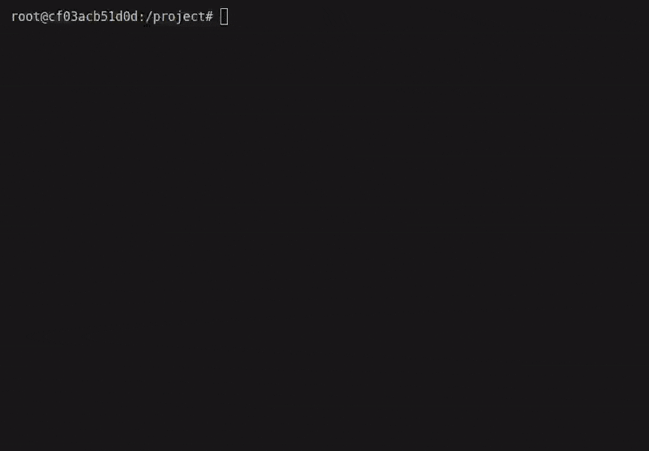

# exportcase

Opinionated file name validator for TypeScript.



## Features

- Enforces strict file name conventions based on exported content
- Provides clear error messages with suggestions for correct naming

## Installation

```bash
npm install --save-dev exportcase
```

## Usage

### Command Line

```bash
exportcase check ./src
```

## Validation Rules

exportcase enforces the following naming convention:

- File names must exactly match the name of the single named export